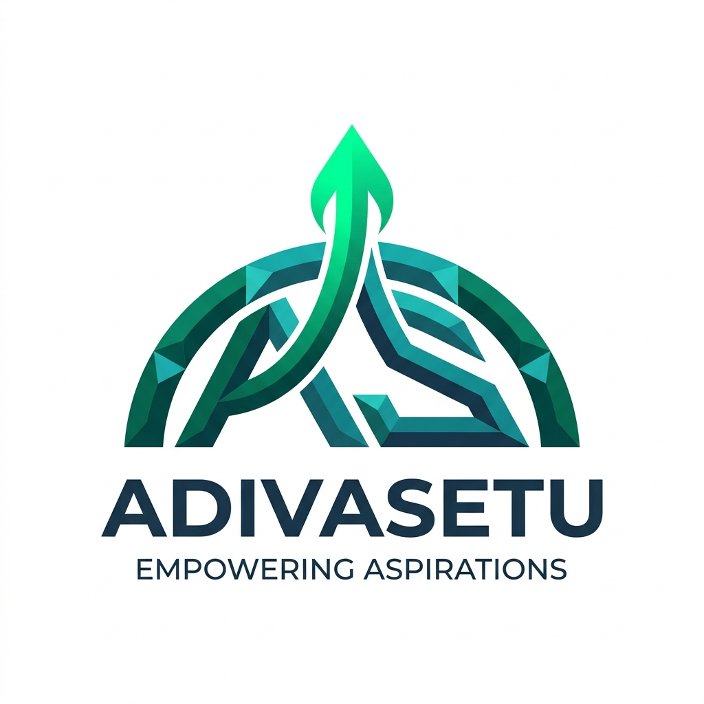

<div align="center">



# AdivaSetu (अदिवा सेतु)
### National Digital Governance & Fellowship Platform for Tribal Scholars

[](https://react.dev/)
[](https://www.typescriptlang.org/)
[](https://expressjs.com/)
[](https://www.mongodb.com/cloud/atlas)
[](https://supabase.com/)
[](https://adivasetu-api.onrender.com/)
[](https://vercel.com/)
[](https://tailwindcss.com/)

**Empowering Scheduled Tribe (ST) scholars and researchers across 20 priority states through transparent AI-assisted document scrutiny, dynamic merit ranking, and direct benefit disbursement.**

[Live Backend API](https://adivasetu-api.onrender.com/) • [GitHub Repository](https://github.com/PuneetKumar1790/AdivaSetu)

</div>

---

## 🏛️ Executive Summary

**AdivaSetu** (*Adivasi* + *Setu* / Bridge) is a production-grade **Digital Public Infrastructure (DPI)** platform built for higher education scholarship and research fellowship governance.

Traditionally, tribal scholars applying for prestigious national fellowships (such as **NFST** for Ph.D. research or **NOS** for top global universities) face 6–12 month manual scrutiny delays and outright rejections due to minor documentation anomalies (e.g. an expired financial year income certificate).

**AdivaSetu eliminates bureaucratic friction:**
1. **7-Stage AI Document Scrutiny Engine**: Multilingual OCR extraction, seal detection, and income rule validation.
2. **Zero-Rejection Deficiency Resolution Center**: Scholars receive immediate notifications and upload replacement certificates without losing their merit queue position.
3. **Human-in-the-Loop Decision Governance**: AI provides decision confidence scores, while authorized Ministry officers retain final statutory sign-off under Rule 14(b).
4. **Cloud Native Full Stack Architecture**: Deployed with Express on **Render**, database on **MongoDB Atlas**, document vaults on **Supabase Cloud Storage**, and client on **Vercel**.

---

## 📐 System Architecture

```
                                  ┌──────────────────────────────────────────────┐
                                  │           React 19 Frontend (Vercel)         │
                                  │   (Tailwind v4 • Vite • Linear SaaS UI)      │
                                  └──────────────────────┬───────────────────────┘
                                                         │
                                        Reverse Proxy /api (vercel.json)
                                                         │
                                                         ▼
                                  ┌──────────────────────────────────────────────┐
                                  │       Express.js Core API (Render Live)      │
                                  │          (https://adivasetu-api.onrender.com) │
                                  └───┬───────────────────────────────┬──────────┘
                                      │                               │
                Mongoose Queries & Transactions        Supabase File Streaming SDK
                                      │                               │
                                      ▼                               ▼
                 ┌───────────────────────────┐   ┌─────────────────────────────┐
                 │   MongoDB Atlas Cluster   │   │   Supabase Cloud Storage    │
                 │   - 90+ Scholar Apps      │   │   - Bucket: "documents"     │
                 │   - Users & Auth State    │   │   - Verified Income & Caste │
                 │   - Immutable Audit Logs  │   │     Certificates (PDF)      │
                 │   - System Notifications  │   │   - Public CDN Object URLs  │
                 └───────────────────────────┘   └─────────────────────────────┘
```

---

## 🌟 Core Features

### 1. For Tribal Scholars (Applicant Experience)
- **Guided 7-Step Application Wizard**: Step-by-step submission including identity, category/tribe, academic records, research proposals, bank DBT details, and mandatory documents.
- **Smart Cloud Document Vault**: Direct upload of certificates (Income, ST Caste, Admission Offer, Research Proposal) stored securely in **Supabase Storage**.
- **Deficiency Resolution Center**: Real-time flagged document updates. When an anomaly is detected, scholars upload a compliant replacement with instant AI re-verification scoring (e.g. **98.6% Pass**).
- **Interactive Fellowship Tracker**: Visual pipeline tracking (*Submitted $\rightarrow$ AI Scrutiny $\rightarrow$ Officer Screening $\rightarrow$ Merit Sanction*).
- **Digital Award Letter**: Instant client-side generation of digitally verifiable provisional fellowship award letters.

### 2. For Ministry Officers (Administrative Experience)
- **National Observability Dashboard**: High-level telemetry showing live applications, DBT disbursements (₹28.45 Cr+), pass rates, and state-wise tribal distributions.
- **AI-Assisted Scrutiny Workspace**:
  - 7 automated scan stages: blur check, multilingual OCR, seal recognition, DigiLocker match, scheme ceiling rules, tamper analysis, and synthesis.
  - Overall AI confidence scoring (e.g. 98.4%).
- **Sovereign Decision Actions**: Officers can accept eligibility, flag specific deficiencies, or recommend candidates for screening committee review.
- **Dynamic Merit Ranking Engine**: Configurable weighting sliders (Academic, Research Proposal, Eligibility, Institution NIRF/QS Ranking, Socio-economic vulnerability).
- **Immutable Security Audit Ledger**: Cryptographically verifiable chronological audit trail tracking every document upload, state transition, and officer remark.

---

## 🏛️ Supported Schemes

| Scheme Code | Full Scheme Name | Target Level |
|---|---|---|
| **NFST** | National Fellowship for ST Students | Ph.D. / M.Phil Research Fellowships |
| **NOS** | National Overseas Scholarship | Master's & Doctoral Studies Abroad (Oxford, Edinburgh, Harvard) |
| **TCE-ST**| Top Class Education for ST Students | Premier National Institutions (IITs, IIMs, AIIMS, NLUs) |
| **PMS-ST**| Post-Matric Scholarship for ST Students | Higher Secondary & Undergraduate Studies |
| **PRE-ST**| Pre-Matric Scholarship for ST Students | Secondary School Tribal Education Support |

---

## 🛠️ Technology Stack

| Layer | Technologies |
|---|---|
| **Frontend** | React 19, TypeScript, Vite 6, Tailwind CSS v4, Lucide React, Canvas Confetti |
| **Backend API** | Node.js, Express.js 5, TypeScript (`tsx`), CORS, Dotenv |
| **Database** | MongoDB Atlas (Mongoose ODM, replica sets, Atlas Search) |
| **Cloud Storage** | Supabase Storage (`@supabase/supabase-js`, WebSocket `ws` transport) |
| **Hosting & Infra** | **Render** (Express API Web Service) + **Vercel** (Frontend SPA + Edge Proxy) |
| **Testing** | Node.js Automated E2E Test Suite (`test:backend`, `test:upload`) |

---

## 📡 Live Backend API Reference

Base URL: `https://adivasetu-api.onrender.com`

| Method | Endpoint | Description |
|---|---|---|
| `GET` | `/` | Service root and deployment health information |
| `GET` | `/api/health` | API operational status and MongoDB connection state |
| `GET` | `/api/analytics/stats` | Aggregated national dashboard statistics |
| `GET` | `/api/applications` | Paginated applications list with search, scheme, and status filters |
| `GET` | `/api/applications/:id` | Detailed application record with documents and audit trail |
| `POST` | `/api/applications` | Register and submit a new fellowship application |
| `PATCH`| `/api/applications/:id/status` | Update application status with officer remarks and audit entry |
| `POST` | `/api/applications/:id/deficiency` | Resolve document deficiency with replacement file metadata |
| `POST` | `/api/documents/upload` | Base64 document upload directly to Supabase Storage bucket |
| `GET` | `/api/audit-logs` | Immutable audit trail query with actor role filters |
| `GET` | `/api/notifications` | User and officer notification feed |
| `PATCH`| `/api/notifications/:id/read` | Mark notification as read |
| `POST` | `/api/auth/login` | User authentication (Scholar / Ministry Officer) |
| `GET` | `/api/auth/me` | Fetch active authenticated session details |

---

## ⚙️ Environment Configuration

Create a `.env` file in the project root:

```env
# Server Port
PORT=5000

# MongoDB Atlas Connection
MONGODB_URI=mongodb+srv://<username>:<password>@cluster0.oq6h0ge.mongodb.net/adivasetu?retryWrites=true&w=majority&appName=Cluster0

# Supabase Storage Configuration (Server)
SUPABASE_URL=https://<project-id>.supabase.co
SUPABASE_ANON_KEY=sb_publishable_...
SUPABASE_SERVICE_ROLE_KEY=sb_secret_...

# Supabase Storage Configuration (Vite Client)
VITE_SUPABASE_URL=https://<project-id>.supabase.co
VITE_SUPABASE_ANON_KEY=sb_publishable_...

# Frontend API Base URL (Set in Vercel to your Render service URL; leave empty for local development)
VITE_API_BASE_URL=https://adivasetu-api.onrender.com
```

---

## 💻 Local Setup & Development

### Prerequisites
- Node.js 20+ installed
- Git installed

### 1. Clone & Install
```bash
git clone https://github.com/PuneetKumar1790/AdivaSetu.git
cd AdivaSetu
npm install
```

### 2. Start Backend Server
```bash
npm run server
# Server boots on http://localhost:5000
```

### 3. Start Frontend Client (in a separate terminal)
```bash
npm run dev
# Frontend boots on http://localhost:5173
```

### 4. Build for Production
```bash
npm run build
```

---

## 🧪 Automated Testing

AdivaSetu includes automated end-to-end test suites that verify cloud database connectivity and storage uploads:

```bash
# 1. Run full 17-point backend API endpoint test suite
npm run test:backend

# 2. Run real PDF generation, Supabase upload & Atlas attachment test
npm run test:upload
```

---

## 🚀 Deployment Guide

### Deploying the Backend on Render
1. Log in to [Render Dashboard](https://dashboard.render.com/) and create a new **Web Service**.
2. Connect the GitHub repository `PuneetKumar1790/AdivaSetu`.
3. Set **Build Command**: `npm install`
4. Set **Start Command**: `npm start`
5. Add Environment Variables:
   - `PORT`: `5000`
   - `MONGODB_URI`: Your MongoDB Atlas URI
   - `SUPABASE_URL`: Your Supabase URL
   - `SUPABASE_SERVICE_ROLE_KEY`: Your Supabase Secret Key
6. Click **Create Web Service**.

### Deploying the Frontend on Vercel
1. Import `PuneetKumar1790/AdivaSetu` in [Vercel](https://vercel.com).
2. Framework: `Vite`
3. Add Environment Variable:
   - `VITE_API_BASE_URL`: `https://your-render-service.onrender.com`
4. Deploy! Vercel's `vercel.json` will automatically reverse-proxy `/api/*` requests to your Render backend with zero CORS issues.

---

## 👥 Demo Personas

| Role | Name | Email | Access |
|---|---|---|---|
| **ST Scholar** | Aarav Kumar (Santhal Tribe) | `aarav.kumar.st@tribal.edu.in` | Applicant Dashboard, Deficiency Center, Fellowship Tracker |
| **Ministry Officer** | Dr. Rajesh Verma | `rajesh.verma@tribal.gov.in` | Scrutiny Queue, Analytics, Merit Rankings, Audit Ledger |

---

## 📄 License & Acknowledgements

Developed as part of the digital governance initiative for tribal higher education empowerment under the **Ministry of Tribal Affairs, Government of India**.
